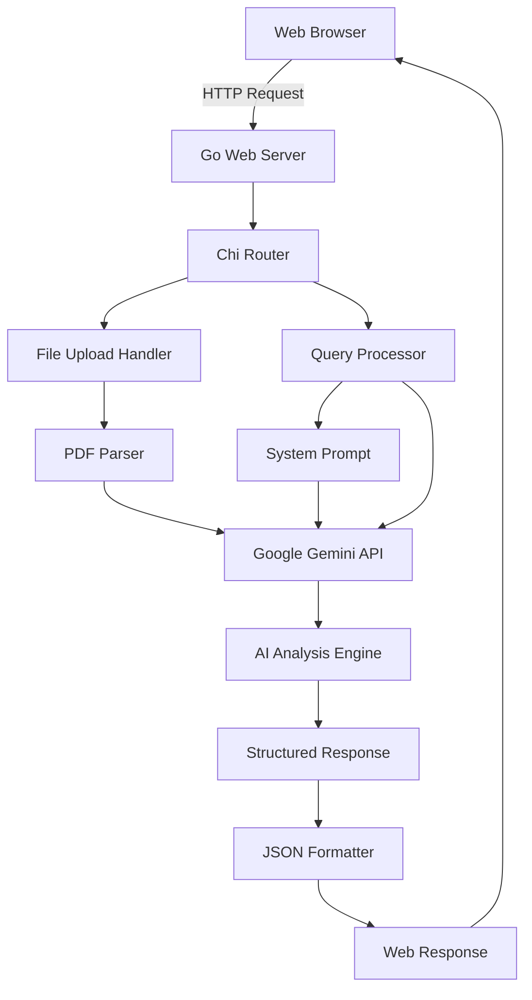

# 🏥 Process Claims - AI-Powered Insurance Claims Processing

<div align="center">


*🤖 Revolutionizing insurance claim processing with intelligent document analysis and AI-driven decision making*

[Features](#-features) • [Quick Start](#-quick-start) • [Installation](#-installation) • [Usage](#-usage) • [API](#-api-reference)

</div>

---

## 🌟 Overview

**Process Claims** is an intelligent, AI-powered web application that transforms the way insurance claims are processed. Built for the Bajaj Hackathon, this system leverages Google's cutting-edge Gemini 2.5 Flash AI model to analyze insurance documents, understand natural language queries, and provide detailed, structured responses with clear justifications.

### 🎯 The Problem We Solve

Traditional insurance claim processing is:
- ⏱️ **Time-consuming** - Manual review takes hours or days
- 📄 **Error-prone** - Human oversight can miss critical details
- 💰 **Expensive** - Requires extensive human resources
- 🔍 **Inconsistent** - Different reviewers may reach different conclusions

### 💡 Our Solution

Process Claims automates and enhances the entire workflow:
- 🚀 **Instant Analysis** - Get detailed claim assessments in seconds
- 🎯 **High Accuracy** - AI-powered semantic understanding beats keyword matching
- 📊 **Structured Output** - Consistent, traceable decision-making
- 🔗 **Source Attribution** - Every decision linked to specific document clauses

---

## ✨ Features

<table>
<tr>
<td>

### 🧠 **Intelligent Document Analysis**
- Multi-format document support (PDF, etc.)
- Semantic understanding vs keyword matching
- Context-aware information extraction
- Complex clause interpretation

</td>
<td>

### 🔍 **Natural Language Processing**
- Plain English query processing
- Entity extraction and categorization
- Intent recognition and classification
- Contextual relationship mapping

</td>
</tr>
<tr>
<td>

### ⚡ **Real-time Processing**
- Instant claim evaluation
- Live web interface with HTMX
- Background processing capabilities
- Responsive design for all devices

</td>
<td>

### 📈 **Structured Decision Making**
- JSON-formatted responses
- Confidence scoring
- Detailed justifications
- Recommendation engine

</td>
</tr>
</table>

---

## 🚀 Quick Start

Get up and running in under 5 minutes!

```bash
# Clone the repository
git clone https://github.com/42yash/process-claims.git
cd process-claims

# Install dependencies
go mod download

# Set up your Google AI API key
export GOOGLE_API_KEY="your-api-key-here"

# Build and run
go build -o process-claims
./process-claims
```

🌐 **Open your browser to** `http://localhost:8080`

---

## 📦 Installation

### Prerequisites

- **Go 1.24.5+** - [Download Go](https://golang.org/dl/)
- **Google AI API Key** - [Get your key](https://makersuite.google.com/app/apikey)

### System Requirements

| Component | Minimum | Recommended |
|-----------|---------|-------------|
| **RAM** | 2GB | 4GB+ |
| **Storage** | 100MB | 500MB+ |
| **Network** | Internet connection for AI API |

### Step-by-Step Installation

#### 1. Install Go (Ubuntu/Debian)
```bash
sudo apt update
sudo apt install -y golang-go
go version  # Verify installation
```

#### 2. Clone and Setup Project
```bash
# Clone the repository
git clone https://github.com/42yash/process-claims.git
cd process-claims

# Download dependencies
go mod download
go mod tidy

# Create static directory
mkdir -p static
```

#### 3. Configure Environment
```bash
# Get your Google AI API key from: https://makersuite.google.com/app/apikey
export GOOGLE_API_KEY="your-actual-api-key-here"

# Optional: Set custom port (default: 8080)
export PORT=8080
```

#### 4. Build and Run
```bash
# Build the application
go build -o process-claims

# Run the application
./process-claims
```

### Alternative: Development Mode
```bash
# Run directly without building
go run .
```

---

## 🎮 Usage

### Web Interface

1. **Navigate** to `http://localhost:8080`
2. **Enter your query** in plain English:
   ```
   "46-year-old male, knee surgery in Pune, 3-month-old insurance policy"
   ```
3. **Upload** your insurance document (PDF)
4. **Click Submit** and get instant analysis!

### Query Examples

<details>
<summary>🏥 <strong>Medical Claims</strong></summary>

```
"35-year-old female, cardiac surgery, emergency procedure, 2-year policy"
"Diabetes treatment for 60-year-old, outpatient care, premium policy"
"Accident-related orthopedic surgery, 28-year-old male, basic coverage"
```
</details>

<details>
<summary>🚗 <strong>Vehicle Claims</strong></summary>

```
"Car accident damage, 2019 Honda Civic, comprehensive coverage"
"Motorcycle theft, 2021 Yamaha, third-party insurance"
"Flood damage to vehicle, comprehensive policy, Mumbai location"
```
</details>

<details>
<summary>🏠 <strong>Property Claims</strong></summary>

```
"Fire damage to residential property, full coverage policy"
"Burglary claim, electronics stolen, home insurance"
"Water damage from pipe burst, apartment coverage"
```
</details>

---

## 🏗️ Architecture



### Technology Stack

| Layer | Technology | Purpose |
|-------|------------|---------|
| **Frontend** | HTML5, HTMX, Pico.css | Modern, responsive UI |
| **Backend** | Go 1.24.5 | High-performance server |
| **Router** | Chi v5 | Fast HTTP routing |
| **AI Engine** | Google Gemini 2.5 Flash | Document analysis |
| **File Handling** | Multipart forms | PDF upload processing |

---

## 📊 API Reference

### Endpoints

#### `GET /`
Returns the main application interface.

#### `POST /submit`
Processes insurance claim analysis.

**Request Format:**
```http
POST /submit
Content-Type: multipart/form-data

query: "Your natural language query"
document_file: [PDF file]
```

**Response Format:**
```json
{
    "decision": "approved|rejected|pending",
    "amount": 50000.00,
    "confidence": "high",
    "justification": {
        "primary_reasoning": "Policy covers the specified medical procedure",
        "supporting_clauses": [
            {
                "clause_reference": "Section 4.2.1",
                "clause_text": "Emergency medical procedures are covered...",
                "application": "Patient's cardiac surgery qualifies as emergency procedure"
            }
        ],
        "key_factors": {
            "entity_analysis": {
                "extracted_entities": ["35-year-old female", "cardiac surgery", "emergency"],
                "missing_information": ["exact procedure cost", "hospital details"]
            },
            "rule_application": "Emergency medical coverage rules applied",
            "calculation_method": "Base coverage amount with emergency multiplier"
        }
    },
    "recommendations": [
        "Verify hospital accreditation",
        "Obtain detailed medical reports"
    ],
    "flags": [
        "High-value claim requires additional verification"
    ]
}
```

---

## 🛠️ Configuration

### Environment Variables

| Variable | Description | Default | Required |
|----------|-------------|---------|----------|
| `GOOGLE_API_KEY` | Google Gemini AI API key | - | ✅ Yes |
| `PORT` | Server port | `8080` | ❌ No |

### File Structure

```
process-claims/
├── 📁 .git/                 # Git repository
├── 📄 go.mod                # Go module definition
├── 📄 go.sum                # Go module checksums
├── 📄 handlers.go           # HTTP request handlers
├── 📄 main.go               # Application entry point
├── 📄 system_prompt.txt     # AI system instructions
├── 📁 static/               # Static web assets
├── 📁 templates/            # HTML templates
│   └── 📄 home.html         # Main web interface
└── 📄 README.md             # This file
```

---

## 🤝 Contributing

We welcome contributions! Here's how you can help:

### Development Setup

```bash
# Fork the repository on GitHub
# Clone your fork
git clone https://github.com/YOUR-USERNAME/process-claims.git
cd process-claims

# Create a feature branch
git checkout -b feature/amazing-feature

# Make your changes
# Test your changes
go test ./...

# Commit and push
git commit -m "Add amazing feature"
git push origin feature/amazing-feature

# Create a Pull Request on GitHub
```

### Code Style

- Follow Go conventions and `gofmt` formatting
- Write clear, descriptive commit messages
- Add tests for new functionality
- Update documentation as needed

---

## 📄 License

This project is licensed under the MIT License - see the [LICENSE](LICENSE) file for details.

---

## 🙏 Acknowledgments

- **Google AI Team** - For the powerful Gemini 2.5 Flash model
- **Go Community** - For excellent libraries and tools
- **Bajaj Hackathon** - For inspiring this innovation
- **Chi Router** - For fast, lightweight HTTP routing
- **HTMX** - For modern, dynamic web interactions

---

## 🆘 Support

<div align="center">

**Need Help?**

[📧 Email](mailto:support@process-claims.com) • [💬 Issues](https://github.com/42yash/process-claims/issues) • [📖 Wiki](https://github.com/42yash/process-claims/wiki)

---

**Made with ❤️ for Bajaj Hackathon 2025**

*Transforming Insurance Claims Processing, One AI Decision at a Time*

</div>
